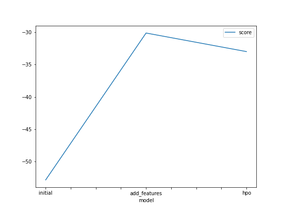
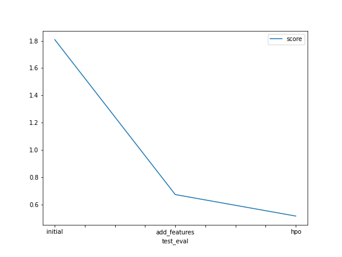

# Report: Predict Bike Sharing Demand with AutoGluon Solution
#### Kamoy Saunders

## Initial Training
### What did you realize when you tried to submit your predictions? What changes were needed to the output of the predictor to submit your results?
The changes that were needed to submit included setting all negative values to 0. 

### What was the top ranked model that performed?
The model that performed best was WeightedEnsemble_L3 with best score during initial training and after new features were added

## Exploratory data analysis and feature creation
### What did the exploratory analysis find and how did you add additional features?
For EDA we outputted a histogram showing all the features. For new features I added four by splitting the datetime into year, month, day and hour.

### How much better did your model preform after adding additional features and why do you think that is?
After adding new features the score was  0.67211. The target variable can be modeled better since we are adding more information about it.

## Hyper parameter tuning
### How much better did your model preform after trying different hyper parameters?
After adding a different time limit and changing hyperparameter to 'very_light' the model performed a lot better than the initial and even got a better kaggle score than when new features were added. 

### If you were given more time with this dataset, where do you think you would spend more time?
I would spend more time tweaking hyperparameters to see if I could get even better results. 

### Create a table with the models you ran, the hyperparameters modified, and the kaggle score.
|model|hpo1|hpo2|hpo3|score|
|--|--|--|--|--|
|initial|'default_value|'default_value|'default_value|1.80815|
|add_features|'default_value|'default_value|'default_value|0.67211 |
|hpo|'time_limit = 2*60' | 'scheduler : local' |'searcher : auto'| 0.51451|

### Create a line plot showing the top model score for the three (or more) training runs during the project.

### Create a line plot showing the top kaggle score for the three (or more) prediction submissions during the project.

## Summary
I learnt a lot from this project and learned the benefits of exploratory data analysis. I will be spending more time reading up on hyperparameter tuning and adding new features. The overall scores for the 3 models are initial = 1.80815, new features = 0.67211 and hpo = 0.51451. 
